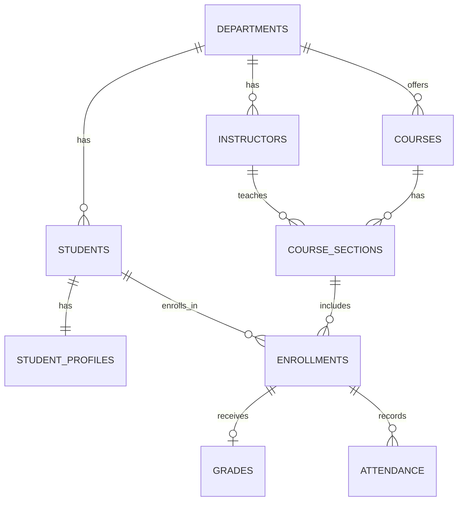

# 🎓 University Learning Management Database

## 📌 Project Goal

To design and build a robust relational database system for managing university operations while practicing PostgreSQL database design, relationships, data integrity, CRUD operations, JOINs, and analytical queries.

## 🛠️ Tech Stack

- **Database:** PostgreSQL
- **Tooling:** pgAdmin / psql CLI

## 🎯 Project Objectives

- Design a normalized relational database for a university.
- Implement relationships between different university entities.
- Maintain data integrity using PostgreSQL constraints.
- Practice CRUD operations and relational queries.
- Build useful academic reports and analytics.
- Progressively introduce advanced PostgreSQL concepts.

---

## 🛠️ PostgreSQL Concepts Implemented

### SQL Operations

- `CREATE TABLE`
- `INSERT`
- `SELECT`
- `UPDATE`
- `DELETE`
- `WHERE`
- `ORDER BY`

### Database Design & Integrity

- Primary Keys
- Foreign Keys
- `UNIQUE`
- `NOT NULL`
- `CHECK`
- `SERIAL`
- `ON DELETE SET NULL`
- `ON DELETE CASCADE`

### Relationships

- One-to-One relationships
- One-to-Many relationships
- Many-to-Many relationships
- Junction/Association tables

### Querying & Analytics

- `JOIN`
- Multi-table JOINs
- `GROUP BY`
- `COUNT()`
- `AVG()`
- `LIMIT`
- `HAVING`
- `CASE`

## 🗃️ Current Database Implementation

The current database contains:

- **Departments** — university academic departments.
- **Students** — student records and enrollment information.
- **Student Profiles** — additional student personal information.
- **Instructors** — instructor information and department assignments.
- **Courses** — courses offered by departments.
- **Course Sections** — specific course offerings by semester, year, room, and instructor.
- **Enrollments** — connects students with course sections.
- **Grades** — stores academic marks and grades associated with student enrollments.
- **Attendance** — records student attendance for enrolled course sections.

## 📂 Project Structure

```text
University_Management_Database/
│
├── README.md
│
└── database/
    ├── schema.sql
    ├── seed.sql
    └── queries.sql
```

## 🗃️ Current Database Structure



## 💻 How to Run

1. Connect to your PostgreSQL server using **pgAdmin** or your preferred CLI.
2. Create a new database named `university_management_db`.
3. Open the Query Tool and execute the SQL scripts in the following order:
   - First, run `schema.sql` to build the tables.
   - Next, run `seed.sql` to insert the initial data.
   - Finally, use `queries.sql` to test the relationships and view the data